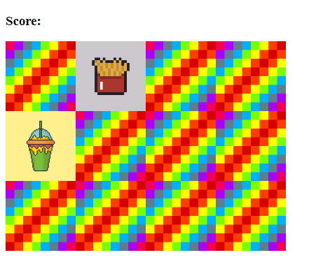

# Memory Game

## Rules of Memory Game
- You will start by flipping over one card
- If the next card you flip matches, a pop up alert notifies you and you get +1 to your score
- These cards then dissapear
- If the next card you flip does not match, a pop up alert notifies you of ths and the cards flip back
- The game continues until you match all the cards on the board

## Inbuilt functions used
- for loops
- addEventListener
- setAttribute
- getAttribute
- data-name
- document.querySelector
- createElement
